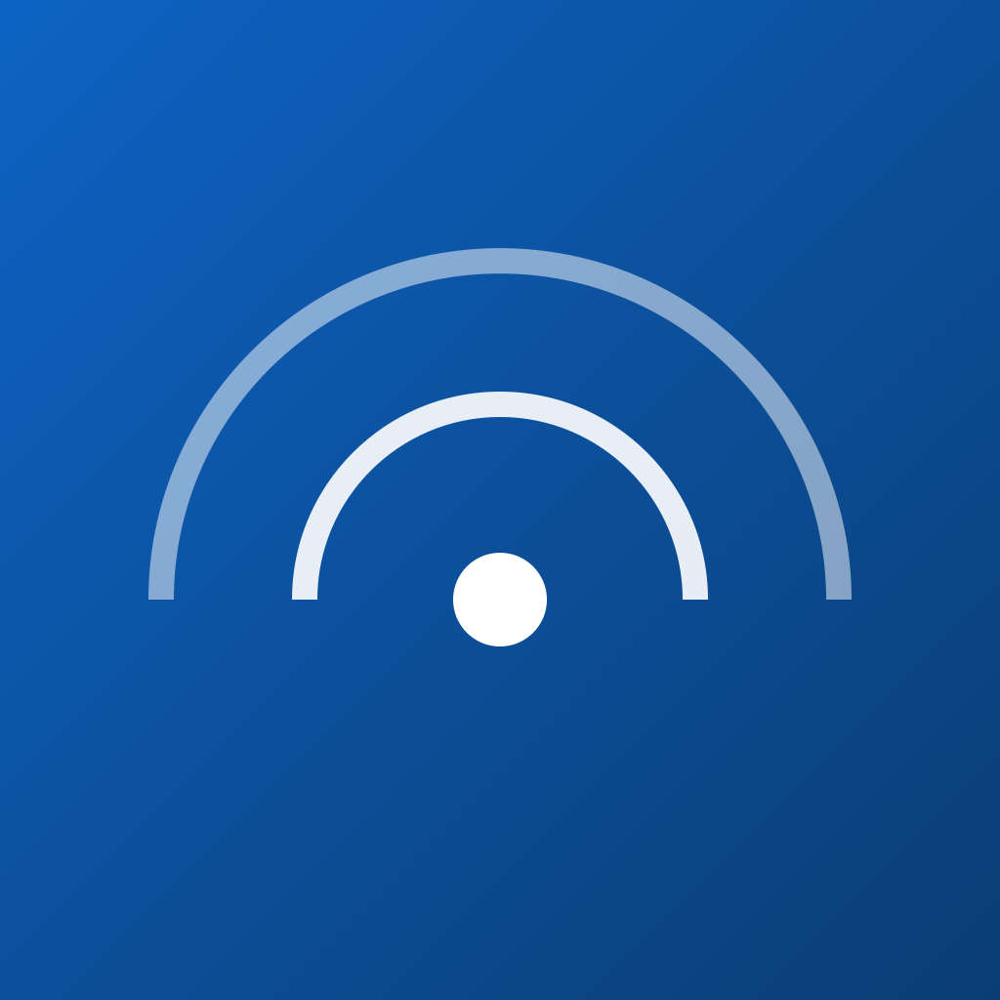

<div align="right">

[English](README.md) · [简体中文](README.zh-CN.md)

</div>

<div align="center">



# 震息 · QuakeSignal

### iPhone・Chrome・macOS・Windows 向けの地震情報、周辺警報、そして防災ガイド。

[](ios/)
[](ios/QuakeSignal/)
[](desktop/)
[](extension/)
[](LICENSE)
[](docs/SIGNING.md)
[](docs/PRIVACY.md)

**[ダウンロード](https://github.com/TastyHeadphones/QuakeSignal/releases/latest)** ·
[macOS へのインストール](#macos-へのインストール) ·
[アンインストール](#アンインストール) ·
[コード署名ポリシー](#コード署名ポリシー) ·
[プライバシーポリシー](docs/PRIVACY.md)

</div>

> [!IMPORTANT]
> QuakeSignal は独立した非公式アプリです。地震情報は第三者が集約したデータに
> 基づいており、遅延・欠落・訂正・不正確が生じる場合があります。必ず公式発表と
> 地域の緊急指示に従ってください。

## できること

| | 機能 | 内容 |
|---|---|---|
| 📡 | リアルタイム地震データ | JMA・CENC・四川・福建・重慶をカバーする Wolfx の7系統のフィードを正規化。 |
| 📍 | 周辺の状況 | 選択した都市または現在地を基準に、距離・方角・半径・マグニチュードで絞り込み。 |
| ⚠️ | 明確な警報状態 | 速報・更新・最終報・キャンセル・訓練を区別し、色だけに頼らない表示。 |
| 🖥️ | ローカルファーストのデスクトップ | 上流の WebSocket に直接接続し、データは端末内に保存。QuakeSignal のバックエンドなしでトレイからネイティブ警報を鳴らせます。 |
| 🌐 | Chrome 拡張 | 同じ直接接続のフィードをブラウザで監視し、履歴を端末内に保存。通知と警報音に対応。 |
| ♿ | アクセシビリティ対応 | Dynamic Type、VoiceOver に配慮したラベル、44pt のタップ領域、高コントラスト表示に対応。 |

## アーキテクチャ

iOS・macOS・Windows は地震データをすべて Wolfx から直接取得します。Cloudflare の
役割は一つだけです。iOS がバックグラウンドまたは終了中でも警報を監視し、条件に
合う通知を APNs で配信します。

- [`ios/`](ios/) —— iOS 17+ 向けのネイティブ SwiftUI アプリ（Swift 6）
- [`desktop/`](desktop/) —— macOS / Windows 向けのローカルファースト Tauri アプリ
- [`extension/`](extension/) —— Manifest V3 の Chrome 拡張
- [`backend/cloudflare/`](backend/cloudflare/) —— 通知専用の Worker と D1
- [`docs/WOLFX_API.md`](docs/WOLFX_API.md) —— 実レスポンスで検証した上流フィールド仕様
- [`docs/DESIGN_PROMPT.md`](docs/DESIGN_PROMPT.md) —— プロダクト/ビジュアル設計仕様

## macOS へのインストール

[最新リリース](https://github.com/TastyHeadphones/QuakeSignal/releases/latest)
から `QuakeSignal_<バージョン>_universal.dmg` をダウンロードして開き、
**QuakeSignal** をアプリケーションフォルダにドラッグします。本プロジェクトの
Homebrew tap からも導入できます:

```bash
brew tap TastyHeadphones/tap
brew install --cask quakesignal
```

### 「壊れている」「開発元を確認できない」と表示される場合

初回起動時、macOS は次のいずれかを表示して起動を拒否することがほとんどです。
*「"QuakeSignal" は壊れているため開けません。ゴミ箱に入れる必要があります。」*
または *「開発元を検証できないため、"QuakeSignal" は開けません。」*

**アプリは壊れておらず、ダウンロードにも問題はありません。** Apple が保証するのは
*公証（notarization）* を受けたアプリだけで、公証には有料の Apple Developer
Program メンバーシップが必要ですが、本プロジェクトはまだ取得していません。macOS は
インターネットから入手したファイルすべてに「隔離（quarantine）」属性を付け、登録
された開発元をたどれない隔離済みアプリの起動を拒否します。この警告は Apple への
登録がないことを示すもので、ファイルの破損を意味しません。ダウンロードの完全性を
確認したい場合は、各リリースで公開している SHA256 チェックサムと照合してください。

以下の**どちらか**を実行してください。インストールしたバージョンごとに一度だけで
済みます。

**方法 1 —— 隔離属性を解除する（コマンド1行）。**
**ターミナル**を開き（⌘ + スペースで `Terminal` と入力して Return）、次の行を
そのまま貼り付けて Return を押します。

```bash
xattr -dr com.apple.quarantine "/Applications/QuakeSignal.app"
```

成功すると何も表示されません。その後は通常どおり QuakeSignal を開けます。

**方法 2 —— システム設定で許可する。**

1. **QuakeSignal** をダブルクリックし、警告を閉じます。
2. アップルメニュー → **システム設定** → **プライバシーとセキュリティ**を開きます。
3. **セキュリティ**セクションまでスクロールすると「"QuakeSignal" は Mac を保護
   するためにブロックされました」と表示されます。
4. **このまま開く**をクリックし、**開く**で確認して、Mac のパスワードを入力します。

> [!NOTE]
> 右クリック（または Control キーを押しながらクリック）→ **開く**は使えなくなり
> ました。Apple が macOS 15 Sequoia でこのショートカットを廃止したため、未公証の
> アプリを許可する手段はシステム設定の**このまま開く**だけです。

Windows 版は上記の影響を受けません。公証は予定しています。詳細は
[`docs/SIGNING.md`](docs/SIGNING.md) を参照してください。

## アンインストール

QuakeSignal はアプリ本体の場所と専用のデータディレクトリ以外には書き込みません。
この2つを削除すれば何も残りません。

### Windows

標準の方法 —— **設定 → アプリ → インストールされているアプリ → QuakeSignal →
アンインストール** —— を使うか、インストール先フォルダ内のアンインストーラーを
実行します。`.exe` と `.msi` のどちらのパッケージもアンインストーラーを登録します。

設定と履歴も削除する場合は、次を削除してください。

```
%APPDATA%\com.quakesignal.desktop\
```

### macOS

Homebrew tap から導入した場合:

```bash
brew uninstall --cask quakesignal
```

それ以外の場合は、アプリケーションフォルダの **QuakeSignal** をゴミ箱に移動します。

設定と履歴も削除する場合は、次を削除してください。

```bash
rm -rf ~/Library/Application\ Support/com.quakesignal.desktop
```

`brew uninstall --cask --zap quakesignal` を使えば、アプリと上記ディレクトリを
まとめて削除できます。

## クイックスタート

**iOS** —— `ios/QuakeSignal.xcodeproj` を Xcode で開き、シミュレータを選んで
`QuakeSignal` スキームを実行します。地震データは Wolfx から直接取得し、
Cloudflare は通知登録にのみ使用します。プッシュ通知には実機、Apple Developer
チーム、APNs 認証情報が必要です。

**デスクトップ** —— デスクトップ版は Wolfx に直接接続し、どちらのバックエンドも
必要としません。

```bash
cd desktop
npm ci
npm run tauri dev
```

**Chrome** —— `chrome://extensions` でデベロッパーモードを有効にし、
**パッケージ化されていない拡張機能を読み込む**から `extension/` を選択します。

## ローカライズ

ユーザー向けの画面はすべて英語（`en`）、日本語（`ja`）、簡体字中国語
（`zh-Hans`）に対応しています。

## コード署名ポリシー

QuakeSignal のコード署名ポリシー —— 何に署名するのか、リリースをどうビルドするの
か、誰が署名を承認できるのか —— は
[`docs/SIGNING.md`](docs/SIGNING.md) に記載しています。プライバシーについては
[`docs/PRIVACY.md`](docs/PRIVACY.md) を参照してください。

**チームの役割。** QuakeSignal はメンテナー1名のプロジェクトです。
[@TastyHeadphones](https://github.com/TastyHeadphones) が Author・Reviewer・
Approver の3つの役割すべてを担います。外部からのプルリクエストはすべてメンテナー
のレビューを経てからマージされ、署名リクエストは毎回メンテナーの明示的な承認を
必要とします。タグを push しただけでは署名は行われません。

各リリースでは、すべての成果物を対象とした `SHA256SUMS.txt` を公開しています。
デスクトップ版のバイナリはバージョンタグから GitHub Actions のみでビルドされ、
メンテナーのマシンからアップロードされることはありません。

QuakeSignal は Windows のコード署名に SignPath Foundation を利用しています。署名
鍵は SignPath のハードウェアセキュリティモジュール内に保管され、本リポジトリ、
CI、メンテナーのマシンのいずれにも存在しません。

Free code signing provided by [SignPath.io](https://signpath.io?utm_source=foundation&utm_medium=github&utm_campaign=quakesignal),
certificate by [SignPath Foundation](https://signpath.org/)。

> [!NOTE]
> SignPath Foundation への申請は審査中のため、Windows の署名は設定済みですが
> まだ有効ではなく、macOS ビルドも未公証です。各リリースには、そのリリース自身の
> 署名状態を明記しています。

## ライセンス

QuakeSignal は [MIT License](LICENSE) のもとで公開されています。
