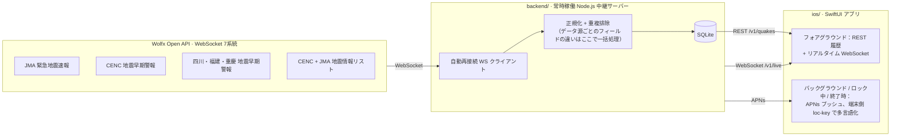

<div align="right">

[English](README.md) · [简体中文](README.zh-CN.md)

</div>

<div align="center">

# 震息 · QuakeSignal

**ネイティブ iOS 地震速報アプリ —— 英語・日本語・簡体字中国語対応。**
[Wolfx Open API](https://wolfx.jp) 経由で気象庁（JMA）、中国地震台网中心
（CENC）、四川・福建・重慶の各地震局が発表する公式速報を転送し、発表から数秒で
ユーザーに警報を届けます —— アプリが終了していても。

</div>

<p align="center">
  
  
  
</p>

<p align="center"><sub>実機（Simulator）のスクリーンショット —— <code>xcodebuild</code> でビルドし、実際のバックエンドと実際の Wolfx データに接続して動作確認済み。同一ビルドで3言語を切り替え。</sub></p>

## アーキテクチャ

iOS はアプリがバックグラウンドや終了状態のときに WebSocket 接続を維持することを
許可していません —— ロック中や終了中の端末に人命に関わる警報を届ける方法は、
サーバー側で Apple Push Notification service（APNs）経由に中継する以外にありませ
ん。そのためこのアプリは Wolfx に直接接続せず、常に自前のバックエンドとだけ通信し
ます。



- [`ios/`](ios/) —— SwiftUI アプリ（iOS 17+、Swift 6）。Xcode プロジェクトは XcodeGen で生成しコミット済み
- [`backend/`](backend/) —— 中継 + プッシュサーバー。APNs 設定は [backend/README.md](backend/README.md) を参照
- [`docs/WOLFX_API.md`](docs/WOLFX_API.md) —— 実際のレスポンスで検証した Wolfx API のフィールドリファレンス
- [`docs/DESIGN_PROMPT.md`](docs/DESIGN_PROMPT.md) —— 英語のプロダクト/デザイン仕様書

## クイックスタート

**バックエンド**（先に起動が必要 —— これがないとアプリには何も表示されません）：
```bash
cd backend
cp .env.example .env   # APNs キーは後回しでOK。ローカル開発ではサーバーは問題なく動きます
npm install
npm run dev
```

**iOS** —— `ios/QuakeSignal.xcodeproj` を Xcode で開き、Simulator で実行してくださ
い。デフォルトでは `http://localhost:8080` に接続します（Simulator は Mac 自身の
localhost に常にアクセスできます）。設定は
[`ios/QuakeSignal/Networking/BackendConfig.swift`](ios/QuakeSignal/Networking/BackendConfig.swift)
を参照。プッシュ通知には実機と実際の APNs 認証情報が必要です —— 詳細は
[backend/README.md](backend/README.md)。

## 現在の状況

| 項目 | 状態 |
|---|---|
| バックエンド | Wolfx の7データ源すべてを中継。自動再接続/バックオフ、重複排除と更新判定、イベントごとの速報更新履歴、距離/半径 + 夜間サイレント + 訓練情報のプッシュフィルタリング、SQLite への保存、REST API、リアルタイム WebSocket 配信、`loc-key` による端末側多言語化に対応した APNs プッシュを実装済み。実際の Wolfx データでスモークテスト済み。 |
| iOS | デザイン案に沿った5タブ構成（ホーム/一覧/地図/ガイド/設定）：都市登録またはGPSに基づく購読と「あなたから何km」という位置情報ベースの見せ方をアプリ全体に反映、3状態のホームステータスカード、リアルタイムカウントダウンと「姿勢を低く・頭を守る・動かない」のイラスト付き全画面警報（最終報・キャンセル・訓練テストの独立した状態も含む）、速報更新履歴タイムライン付きのイベント詳細、絞り込み可能な一覧と地図、防災ガイド（対応手順・非常持ち出し袋チェックリスト・端末内家族安否確認）、独立した情報源・免責事項画面、そしてデザイン案通りの正確なカラートークンとアプリアイコン案を実装。en / ja / zh-Hans の完全なローカライズ済み。Swift 6 の厳格な並行処理モードで `xcodebuild` によるビルド成功、Simulator 上で実データに接続し3言語すべてで動作確認済み。 |

## 元デザインについて

デザインは `claude.ai/design` の1プロジェクト（「震息 · QuakeSignal iOS App
Design」）にあり、当初はオーナー本人のログインが必要でアクセスできませんでした。
アクセス権をいただいた後に確認したところ、これは完全なデザインシステムでした：
アプリアイコン案、カラー/タイポグラフィ/スペーシングのトークン、コンポーネント一
覧、そしてオンボーディング、ホーム（通常・注意・警報・ダークモードの4状態）、全画
面地震速報、速報の更新履歴タイムライン付きのイベント詳細、絞り込み可能なリストと
地図、設定、防災ガイド、空/読み込み中/エラー状態、そして主要画面の en/ja/zh-Hans
ローカライズまで含む高精細なモックアップでした——アクセス権を得た後にこのプロジェ
クトがどう進化したかは `docs/DESIGN_PROMPT.md` を参照してください。上記のアプリ
は現在このデザインにかなり近づいています。残っている差分は主にピクセル単位のレイ
アウト再現度です。デザイン案は HTML/CSS で作られており、アプリはネイティブ
SwiftUI のため、構造・文言・カラートークン・画面遷移は一致していますが、余白やタ
イポグラフィはピクセル単位で測って再現するのではなく、プラットフォームの慣習に合
わせて調整しています。

## ライセンス

MIT —— [LICENSE](LICENSE) を参照。
