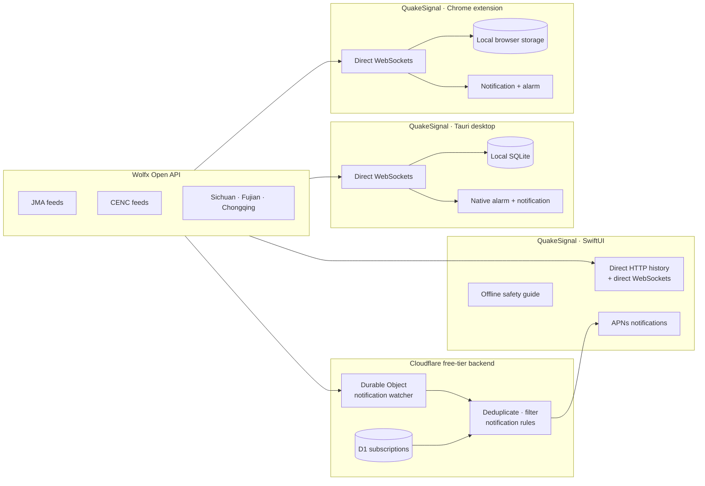

<div align="right">

[简体中文](README.zh-CN.md) · [日本語](README.ja.md)

</div>

<div align="center">


# QuakeSignal

### Earthquake reports, nearby alerts, and preparedness for iPhone, Chrome, macOS, and Windows.

[](ios/)
[](ios/QuakeSignal/)
[](desktop/)
[](extension/)
[](backend/cloudflare/)
[](#localization)
[](LICENSE)
[](docs/SIGNING.md)
[](docs/PRIVACY.md)

**[macOS release status](#installation-on-macos)** ·
**[Microsoft Store (Windows)](https://apps.microsoft.com/detail/9N730S3CZ7Z9)** ·
[Install on macOS](#installation-on-macos) ·
[Uninstall](#uninstalling) ·
[Code signing policy](#code-signing-policy) ·
[Privacy policy](docs/PRIVACY.md)

QuakeSignal turns aggregated public seismic data into focused native apps: an
iOS experience with location-aware push alerts and preparedness guidance, plus
a local-first macOS and Windows monitor with direct feeds and audible alarms.

<br />


&nbsp;&nbsp;

&nbsp;&nbsp;


<sub>Real iOS Simulator captures from the same SwiftUI build in English, Japanese, and Simplified Chinese.</sub>

</div>

> [!IMPORTANT]
> QuakeSignal is an independent, non-official app. Earthquake information comes from third-party aggregated sources and may be delayed, incomplete, revised, or inaccurate. Always follow official announcements and local emergency instructions.

## What it does

| | Capability | Details |
|---|---|---|
| 📡 | Live earthquake data | Normalizes seven Wolfx feeds covering JMA, CENC, Sichuan, Fujian, and Chongqing data. |
| 📍 | Nearby context | Frames events by a selected city or current location, with distance, direction, radius, and magnitude controls. |
| ⚠️ | Clear alert states | Separates preliminary, updated, final, cancelled, and training messages so color is never the only signal. |
| 🔔 | Background delivery | Uses APNs for notifications when the app is backgrounded, locked, or terminated. |
| 🖥️ | Local-first desktop | Connects directly to upstream WebSockets, stores data locally, and can sound a native alarm from the tray—without the QuakeSignal backend. |
| 🌐 | Chrome extension | Monitors the same direct feeds from Chrome, stores history locally, and supports browser notifications and an optional alarm sound. |
| 🗺️ | Explore events | Includes a filterable list, epicenter map, event detail, and report-revision timeline. |
| 🧰 | Offline preparedness | Provides drop-cover-hold-on guidance, situation-specific actions, an emergency checklist, and family check-in notes. |
| ♿ | Accessible by design | Supports Dynamic Type, VoiceOver-friendly labels, 44pt targets, system appearance, and high-contrast status treatments. |

## Designed for the moment that matters

The interface uses calm blue for normal information, escalating orange and red for severity, and a deliberately distinct purple treatment for drills. The complete specification lives in this repository at [`docs/DESIGN_PROMPT.md`](docs/DESIGN_PROMPT.md).

| Normal | Caution | Warning | Training |
|:---:|:---:|:---:|:---:|
| `#30B14F` | `#FF9500` | `#FF3B30` | `#8E5BE0` |
| No significant nearby event | Recent nearby activity | Active protective action | Clearly marked test content |

Those notes cover tokens, components, onboarding, empty and error states, dark mode, and localized screen copy.

## Architecture

iOS, macOS, and Windows fetch all earthquake data directly from Wolfx. Cloudflare has one narrowly scoped job: keep watching alerts while iOS is backgrounded or terminated and deliver matching APNs notifications.



### Repository map

- [`docs/FEATURES.md`](docs/FEATURES.md) — cross-platform feature matrix and backend responsibilities
- [`ios/`](ios/) — native SwiftUI app for iOS 17+, built with Swift 6
- [`desktop/`](desktop/) — local-first Tauri app for macOS and Windows, with direct feeds, SQLite, and native alarms
- [`extension/`](extension/) — Manifest V3 Chrome extension with direct feeds, local history, browser notifications, and alarm sound
- [`assets/app-icon.svg`](assets/app-icon.svg) — resolution-independent source for the design artifact's Epicenter ripples app icon
- [`backend/cloudflare/`](backend/cloudflare/) — notification-only Worker, Durable Object watcher, D1 migration, APNs delivery, and smoke test
- [`backend/`](backend/) — local Node.js notification-pipeline development tools
- [`docs/WOLFX_API.md`](docs/WOLFX_API.md) — field-level upstream data reference verified against live responses
- [`docs/DESIGN_PROMPT.md`](docs/DESIGN_PROMPT.md) — product and visual design specification

## Installation on macOS

There is no supported public macOS download or Homebrew cask yet. The current
`v0.1.0` GitHub Release predates Developer ID signing and notarization, and
`TastyHeadphones/tap` has not published a cask; do not install either one. Once
a later GitHub Release identifies its universal DMG as Developer ID signed,
notarized, stapled, and accompanied by `SHA256SUMS.txt`, download
`QuakeSignal_<version>_universal.dmg`, open it, and drag **QuakeSignal** into
your Applications folder. Homebrew is available only after that exact cask has
been mirrored to the public tap:

```bash
# Run only after the public tap contains a cask for that notarized release.
brew tap TastyHeadphones/tap
brew install --cask quakesignal
```

### Gatekeeper and notarization

The protected macOS release job will sign the direct-download/Homebrew app with
a **Developer ID Application** certificate, notarize it, and staple the ticket
to its DMG. Use only releases that include `SHA256SUMS.txt` and identify the
macOS artifact as notarized.

Do **not** clear the quarantine attribute or bypass Gatekeeper. If macOS blocks
a release built by this process, verify its checksum against `SHA256SUMS.txt`,
keep the downloaded file, and report the release URL and macOS version in an
issue. The legacy `v0.1.0` release is not a supported installation or cask
source.

## Installation on Windows

Download QuakeSignal from the
[Microsoft Store](https://apps.microsoft.com/detail/9N730S3CZ7Z9). The Store
package is certified and signed by Microsoft. Availability depends on the
market where the Store listing has been released.

## Uninstalling

QuakeSignal installs only into its own application location and its own data
directory. Removing both leaves nothing behind.

### Windows

Either use the standard uninstaller — **Settings → Apps → Installed apps →
QuakeSignal → Uninstall** — or run the uninstaller that ships inside the
install folder. Both the `.exe` and `.msi` packages register one.

To also remove stored settings and event history, delete:

```
%APPDATA%\com.quakesignal.desktop\
```

### macOS

If you installed a future public Homebrew cask:

```bash
brew uninstall --cask quakesignal
```

Otherwise drag **QuakeSignal** from your Applications folder to the Trash.

To also remove stored settings and event history, delete:

```bash
rm -rf ~/Library/Application\ Support/com.quakesignal.desktop
```

`brew uninstall --cask --zap quakesignal` removes the app and that directory in
one step.

## Quick start

### 1. Run the iOS app

Open [`ios/QuakeSignal.xcodeproj`](ios/QuakeSignal.xcodeproj) in Xcode, choose an iPhone Simulator, and run the `QuakeSignal` scheme.

Earthquake history and foreground updates go straight to Wolfx. The app uses
Cloudflare only to register for notifications. A Release build uses the
user-approved public Worker endpoint
`https://quakesignal-api.hopeso.workers.dev`; a Debug build must use a
different isolated staging Worker instead. Debug defaults to the non-routable
`https://quakesignal-staging.invalid` until its owner copies
`ios/QuakeSignal/Supporting/Debug.local.xcconfig.example` to the ignored
`Debug.local.xcconfig` and supplies that Worker URL. CI can instead pass
`QUAKESIGNAL_API_BASE_URL=<isolated-staging-url>` to `xcodebuild`; neither route changes
checked-in source. The staging URL must be the protected, isolated
`https://*.workers.dev` Worker described in
[`docs/CLOUDFLARE_PRODUCTION.md`](docs/CLOUDFLARE_PRODUCTION.md#isolated-debug-staging-worker),
never the approved production hostname. Push notifications require a physical
device, an Apple Developer team, and staging APNs credentials.

### 2. Run the desktop app

The desktop edition connects directly to Wolfx and does not require either
backend:

```bash
cd desktop
npm ci
npm run tauri dev
```

Use **Settings → Test Alarm & Notification** to verify native sound and
notification permissions on the current computer.

### 3. Verify

```bash
cd backend
npm run typecheck
npm run build

cd cloudflare
npm run check
# Verify the user-approved production Worker endpoint.
npm run test:remote -- https://quakesignal-api.hopeso.workers.dev

cd ../../desktop
npm run build
cargo test --locked --manifest-path src-tauri/Cargo.toml

cd ../extension
npm test
npm run package
```

The remote smoke test checks notification-watcher health, device-registration validation, and verifies that public earthquake history/detail/live-relay endpoints stay disabled.

## iOS production-release prerequisites

Before a public iOS release:

- Verify the user-approved production Worker endpoint
  `https://quakesignal-api.hopeso.workers.dev`, its public Cloudflare TLS, and
  `/healthz`. A different `workers.dev` hostname is only for isolated
  Debug/staging service and must not be used as a Release fallback.
- Enable App Attest for `com.quakesignal.app`, refresh the production
  provisioning profile, and keep the production Worker in required App Attest
  enforcement mode.
- Keep Debug and Simulator clients on a separate staging Worker with no shared
  production data or credentials. Provision it through the protected
  `cloudflare-staging` environment, then complete physical-device APNs/App Attest,
  registration/deletion and token-refresh tests, then TestFlight APNs testing
  against the approved production endpoint before reviewer approval. The first protected
  production Worker deployment uses the explicit TestFlight-bootstrap phase
  with the App Attest approval variable set to `false`; after the physical
  proof, a reviewer promotes it to `true` and re-runs the protected launch
  phase before public App Review.

## Production backend

The user-approved production notification origin is
[`quakesignal-api.hopeso.workers.dev`](https://quakesignal-api.hopeso.workers.dev).
It is a separate opt-in alert-delivery service:

- Workers provides device registration, removal, test-alert, legal, and health endpoints.
- A Durable Object maintains three upstream watcher sockets solely to detect push-worthy events.
- D1 stores notification subscriptions and internal deduplication state.
- Cloudflare Queues bounds APNs fan-out, retries transient delivery failures, and retains failed work for operator review.
- APNs uses token-based authentication stored as encrypted Worker secrets.
- Production device mutations use Apple's App Attest. Debug/Simulator testing
  uses a separate staging Worker; its development bypass is never enabled in
  production.
- A one-minute alarm reseeds HTTP data and repairs disconnected upstream sockets.

The service deliberately returns `410 Gone` for `/v1/quakes/*` and `/v1/live`; application data belongs on the direct client-to-Wolfx path.

The approved Worker hostname is live and uses Cloudflare's publicly trusted
TLS certificate. APNs credentials and physical-device App Attest verification
remain release prerequisites. The iOS client does not use a private CA or
mutual TLS. A different `workers.dev` host is never a production fallback.

Normal production deployment is only through the protected **Cloudflare Worker
→ Run workflow → deploy_production** job on `main`, which applies migrations,
deploys, and smoke-tests the approved Worker plus its App Store legal URLs. The
one-time TestFlight bootstrap uses the same guarded workflow and is not a
public-launch approval. Deployment, TLS, APNs, and production-monitoring
requirements are documented in
[`backend/README.md`](backend/README.md) and
[`docs/CLOUDFLARE_PRODUCTION.md`](docs/CLOUDFLARE_PRODUCTION.md).

## Localization

Every user-facing flow is localized in:

- English (`en`)
- Japanese (`ja`)
- Simplified Chinese (`zh-Hans`)

Push notification text is localized on-device with APNs `loc-key` values, so a single event can be delivered in each user’s chosen language without storing translated notification copy on the server.

## Safety and delivery limits

- QuakeSignal aggregates data; it is not affiliated with JMA, CENC, Wolfx, or a government emergency agency.
- Mobile push delivery is best-effort and depends on the upstream provider, network, Cloudflare, APNs, iOS settings, Focus modes, and device state.
- The countdown is an estimate based on event time, distance, and a simplified S-wave velocity—not a seismological guarantee.
- Critical Alerts require a separate entitlement granted by Apple. Without it, QuakeSignal uses standard or time-sensitive notifications.

## Code signing policy

QuakeSignal's code signing policy — what is signed, how releases are built, and
who may approve a signature — is documented in
[`docs/SIGNING.md`](docs/SIGNING.md). Privacy is documented separately in
[`docs/PRIVACY.md`](docs/PRIVACY.md).

Windows releases are built as MSIX packages by GitHub Actions and distributed
through Microsoft Store. Microsoft signs the certified Store package; no
Windows signing key or third-party signing service is used by this project.

When a macOS direct-download release is published, it will include
`SHA256SUMS.txt` and be Developer ID signed, notarized, and stapled. A separate
sandboxed package can then be produced for the Mac App Store; it is never
attached to the public GitHub Release.

## License

QuakeSignal is available under the [MIT License](LICENSE).
