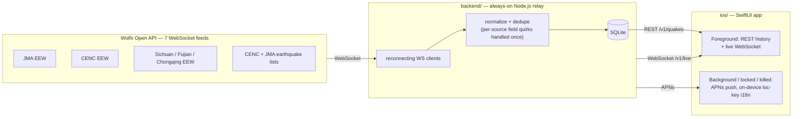

<div align="right">

[简体中文](README.zh-CN.md) · [日本語](README.ja.md)

</div>

<div align="center">

# 震息 · QuakeSignal

**A native iOS earthquake early-warning app — English, 日本語, 简体中文.**
Relays official warnings from JMA, CENC, and the Sichuan / Fujian / Chongqing
earthquake authorities via the [Wolfx Open API](https://wolfx.jp), and gets
an alert in front of the user within seconds — even if the app is closed.

</div>

<p align="center">
  
  
  
</p>

<p align="center"><sub>Actual Simulator screenshots — built with <code>xcodebuild</code>, running against the live backend and live Wolfx data, same build in all three languages.</sub></p>

## Architecture

iOS does not allow an app to hold a WebSocket connection open while
backgrounded or terminated — there is no way to get a life-safety alert to a
locked or closed phone without a server relaying through Apple Push
Notification service (APNs). So the app never talks to Wolfx directly; it
only ever talks to its own backend.



- [`ios/`](ios/) — SwiftUI app (iOS 17+, Swift 6), Xcode project generated via XcodeGen and committed
- [`backend/`](backend/) — the relay + push server, see [backend/README.md](backend/README.md) for APNs setup
- [`docs/WOLFX_API.md`](docs/WOLFX_API.md) — field-level reference for the Wolfx feeds, verified against live responses
- [`docs/DESIGN_PROMPT.md`](docs/DESIGN_PROMPT.md) — the English product/design spec

## Quick start

**Backend** (needed first — the app has nothing to show without it):
```bash
cd backend
cp .env.example .env   # APNs keys can wait; the server runs fine without them for local dev
npm install
npm run dev
```

**iOS** — open `ios/QuakeSignal.xcodeproj` in Xcode and run on a Simulator.
It talks to `http://localhost:8080` by default (Simulator always reaches
your Mac's own localhost), see
[`ios/QuakeSignal/Networking/BackendConfig.swift`](ios/QuakeSignal/Networking/BackendConfig.swift).
Push notifications need a real device and real APNs credentials — see
[backend/README.md](backend/README.md).

## Status

| Piece | State |
|---|---|
| Backend | All 7 Wolfx sources relayed with reconnect/backoff, dedup + update tracking, per-event report-revision history, distance/radius + quiet-hours + drill-alert push filtering, SQLite storage, REST API, live WebSocket fan-out, APNs push with on-device `loc-key` localization. Smoke-tested against live Wolfx data. |
| iOS | 5 tabs (Home / List / Map / Guide / Settings) matching the source design: city/GPS-based subscription with distance framing throughout, 3-state Home banner, full-screen alert with a live countdown and a drop-cover-hold-on illustration (plus distinct final/cancelled/training-drill states), event detail with a report-revision timeline, filterable list and map, a disaster-prep guide (safety steps, checklist, local family check-in), a dedicated source/disclaimer screen, and the design's exact color tokens and app icon concept. Full en / ja / zh-Hans localization. Builds clean with `xcodebuild` under Swift 6 strict concurrency, verified running on Simulator in all three languages against live data. |

## About the source design

The design lives at a `claude.ai/design` project ("震息 · QuakeSignal iOS App
Design") that needed the owner's own login to reach. Once granted, it turned
out to be a full design system: app icon concepts, color/type/spacing
tokens, a component sheet, and high-fidelity mockups for onboarding, home
(normal/caution/alert/dark states), the full-screen EEW alert, event detail
with a report-revision timeline, a filterable list and map, settings, a
disaster-prep guide, empty/loading/error states, and en/ja/zh-Hans
localization of the key screens — see `docs/DESIGN_PROMPT.md` for the note
on how the build evolved once it was reachable. The app above now follows
it closely; a still-open gap is pixel-level layout fidelity, since the
mockup is HTML/CSS and the app is native SwiftUI — the structure, copy,
color tokens, and flows match, but spacing and typography were adapted to
platform conventions rather than measured pixel-for-pixel.

## License

MIT — see [LICENSE](LICENSE).
