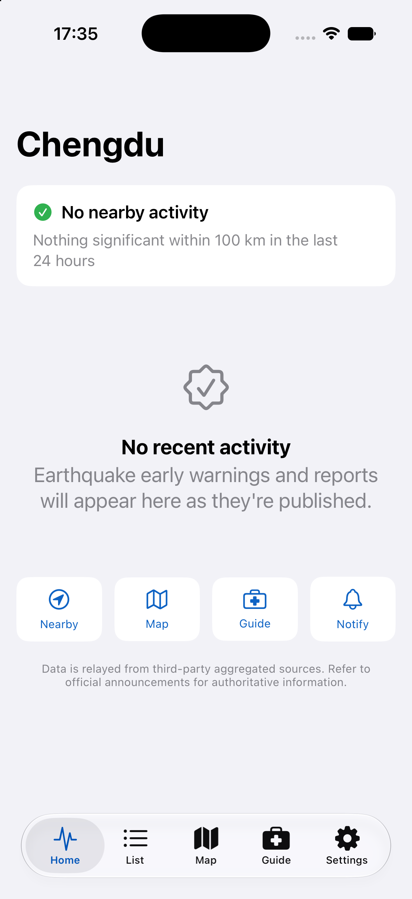
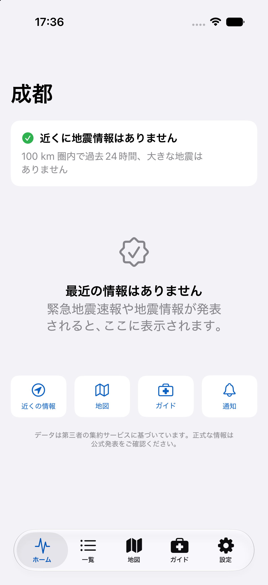
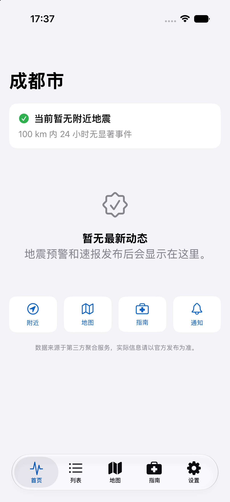
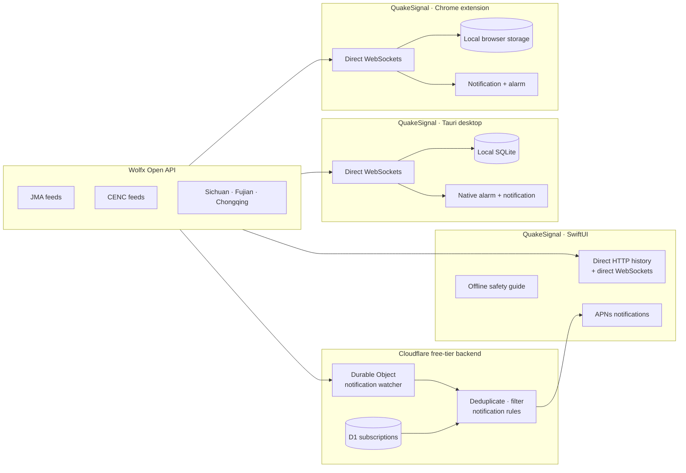

<div align="right">

[简体中文](README.zh-CN.md) · [日本語](README.ja.md)

</div>

<div align="center">


# QuakeSignal

### Earthquake reports, nearby alerts, and preparedness for iPhone, Chrome, macOS, and Windows.

[](ios/)
[](ios/QuakeSignal/)
[](desktop/)
[](extension/)
[](backend/cloudflare/)
[](#localization)
[](LICENSE)

QuakeSignal turns aggregated public seismic data into focused native apps: an
iOS experience with location-aware push alerts and preparedness guidance, plus
a local-first macOS and Windows monitor with direct feeds and audible alarms.

<br />


&nbsp;&nbsp;

&nbsp;&nbsp;


<sub>Real iOS Simulator captures from the same SwiftUI build in English, Japanese, and Simplified Chinese.</sub>

</div>

> [!IMPORTANT]
> QuakeSignal is an independent, non-official app. Earthquake information comes from third-party aggregated sources and may be delayed, incomplete, revised, or inaccurate. Always follow official announcements and local emergency instructions.

## What it does

| | Capability | Details |
|---|---|---|
| 📡 | Live earthquake data | Normalizes seven Wolfx feeds covering JMA, CENC, Sichuan, Fujian, and Chongqing data. |
| 📍 | Nearby context | Frames events by a selected city or current location, with distance, direction, radius, and magnitude controls. |
| ⚠️ | Clear alert states | Separates preliminary, updated, final, cancelled, and training messages so color is never the only signal. |
| 🔔 | Background delivery | Uses APNs for notifications when the app is backgrounded, locked, or terminated. |
| 🖥️ | Local-first desktop | Connects directly to upstream WebSockets, stores data locally, and can sound a native alarm from the tray—without the QuakeSignal backend. |
| 🌐 | Chrome extension | Monitors the same direct feeds from Chrome, stores history locally, and supports browser notifications and an optional alarm sound. |
| 🗺️ | Explore events | Includes a filterable list, epicenter map, event detail, and report-revision timeline. |
| 🧰 | Offline preparedness | Provides drop-cover-hold-on guidance, situation-specific actions, an emergency checklist, and family check-in notes. |
| ♿ | Accessible by design | Supports Dynamic Type, VoiceOver-friendly labels, 44pt targets, system appearance, and high-contrast status treatments. |

## Designed for the moment that matters

The interface follows the [QuakeSignal design artifact](https://claude.ai/code/artifact/f209373f-ec4d-41ee-9c7a-ec315e4861e0): calm blue for normal information, escalating orange and red for severity, and a deliberately distinct purple treatment for drills.

| Normal | Caution | Warning | Training |
|:---:|:---:|:---:|:---:|
| `#30B14F` | `#FF9500` | `#FF3B30` | `#8E5BE0` |
| No significant nearby event | Recent nearby activity | Active protective action | Clearly marked test content |

The complete design notes—including tokens, components, onboarding, empty/error states, dark mode, and localized screen copy—are captured in [`docs/DESIGN_PROMPT.md`](docs/DESIGN_PROMPT.md).

## Architecture

iOS, macOS, and Windows fetch all earthquake data directly from Wolfx. Cloudflare has one narrowly scoped job: keep watching alerts while iOS is backgrounded or terminated and deliver matching APNs notifications.



### Repository map

- [`ios/`](ios/) — native SwiftUI app for iOS 17+, built with Swift 6
- [`desktop/`](desktop/) — local-first Tauri app for macOS and Windows, with direct feeds, SQLite, and native alarms
- [`extension/`](extension/) — Manifest V3 Chrome extension with direct feeds, local history, browser notifications, and alarm sound
- [`assets/app-icon.svg`](assets/app-icon.svg) — resolution-independent source for the design artifact's Epicenter ripples app icon
- [`backend/cloudflare/`](backend/cloudflare/) — notification-only Worker, Durable Object watcher, D1 migration, APNs delivery, and smoke test
- [`backend/`](backend/) — local Node.js notification-pipeline development tools
- [`docs/WOLFX_API.md`](docs/WOLFX_API.md) — field-level upstream data reference verified against live responses
- [`docs/DESIGN_PROMPT.md`](docs/DESIGN_PROMPT.md) — product and visual design specification

## Quick start

### 1. Run the iOS app

Open [`ios/QuakeSignal.xcodeproj`](ios/QuakeSignal.xcodeproj) in Xcode, choose an iPhone Simulator, and run the `QuakeSignal` scheme.

Earthquake history and foreground updates go straight to Wolfx. The app uses the production Cloudflare service only to register for notifications; `QUAKESIGNAL_API_BASE_URL` overrides that notification service during development. Push notifications require a physical device, an Apple Developer team, and APNs credentials.

### 2. Run the desktop app

The desktop edition connects directly to Wolfx and does not require either
backend:

```bash
cd desktop
npm ci
npm run tauri dev
```

Use **Settings → Test Alarm & Notification** to verify native sound and
notification permissions on the current computer.

### 3. Verify

```bash
cd backend
npm run typecheck
npm run build

cd cloudflare
npm run check
npm run test:remote -- https://quakesignal-api.hopeso.workers.dev

cd ../../desktop
npm run build
cargo test --locked --manifest-path src-tauri/Cargo.toml

cd ../extension
npm test
npm run package
```

The remote smoke test checks notification-watcher health, device-registration validation, and verifies that public earthquake history/detail/live-relay endpoints stay disabled.

## Production backend

The production notification service is live at [`quakesignal-api.hopeso.workers.dev`](https://quakesignal-api.hopeso.workers.dev). It uses services available on Cloudflare's free plan for a small public launch:

- Workers provides device registration, removal, test-alert, legal, and health endpoints.
- A Durable Object maintains three upstream watcher sockets solely to detect push-worthy events.
- D1 stores notification subscriptions and internal deduplication state.
- APNs uses token-based authentication stored as encrypted Worker secrets.
- A one-minute alarm reseeds HTTP data and repairs disconnected upstream sockets.

The service deliberately returns `410 Gone` for `/v1/quakes/*` and `/v1/live`; application data belongs on the direct client-to-Wolfx path.

Deployment and APNs setup are documented in [`backend/README.md`](backend/README.md).

## Localization

Every user-facing flow is localized in:

- English (`en`)
- Japanese (`ja`)
- Simplified Chinese (`zh-Hans`)

Push notification text is localized on-device with APNs `loc-key` values, so a single event can be delivered in each user’s chosen language without storing translated notification copy on the server.

## Safety and delivery limits

- QuakeSignal aggregates data; it is not affiliated with JMA, CENC, Wolfx, or a government emergency agency.
- Mobile push delivery is best-effort and depends on the upstream provider, network, Cloudflare, APNs, iOS settings, Focus modes, and device state.
- The countdown is an estimate based on event time, distance, and a simplified S-wave velocity—not a seismological guarantee.
- Critical Alerts require a separate entitlement granted by Apple. Without it, QuakeSignal uses standard or time-sensitive notifications.

## License

QuakeSignal is available under the [MIT License](LICENSE).
