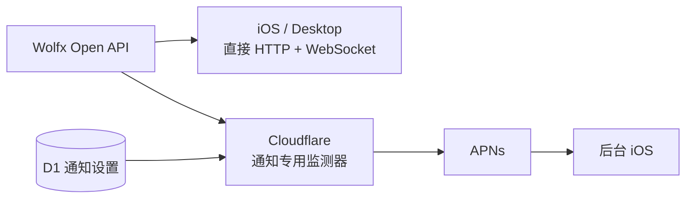

[English](README.md) · [日本語](README.ja.md)

# 震息 · QuakeSignal

**原生 iOS 地震预警应用 —— 支持英语、日本語、简体中文。**
通过 [Wolfx Open API](https://wolfx.jp) 转发日本气象厅（JMA）、中国地震台网中心
（CENC）以及四川、福建、重庆地震局的官方预警，在预警发布后的几秒内把警报送到用户
面前——哪怕应用已经被关闭。

  
  
  

真实的 Simulator 截图 —— 用 <code>xcodebuild</code> 编译并直连 Wolfx 真实数据，同一份构建切换三种语言。

## 整体架构

iOS、macOS 和 Windows 的地震历史与前台实时数据都直接从 Wolfx 获取。
Cloudflare 只负责通知：当 iOS 在后台或已退出时继续监测警报，并通过 APNs
向符合订阅条件的设备发送推送。

- [`ios/`](ios/) —— SwiftUI 应用（iOS 17+，Swift 6），Xcode 工程通过 XcodeGen 生成并已提交
- [`backend/cloudflare/`](backend/cloudflare/) —— 通知专用服务，APNs 配置见 [backend/README.md](backend/README.md)
- [`docs/WOLFX_API.md`](docs/WOLFX_API.md) —— 对照真实返回数据核实过的 Wolfx 接口字段文档
- [`docs/DESIGN_PROMPT.md`](docs/DESIGN_PROMPT.md) —— 英文产品/设计说明书

## 快速开始

**iOS** —— 用 Xcode 打开 `ios/QuakeSignal.xcodeproj`，选 Simulator 运行即可。
地震数据直接从 Wolfx 获取；Cloudflare 仅用于通知注册。
推送通知需要真机 + 真实 APNs 凭证，见 [backend/README.md](backend/README.md)。

## 当前状态

| 部分 | 状态 |
|---|---|
| Cloudflare | 仅负责通知：上游监测、去重、距离/半径与夜间/演习过滤、D1 通知设置、基于 `loc-key` 的 APNs。公开历史 API 与实时中转已禁用。 |
| iOS | 5 个 tab（首页/列表/地图/指南/设置），已对齐设计稿：基于城市/GPS 的订阅与"距你多远"的位置化叙事贯穿全app、三态首页状态卡、带实时倒计时和"趴下-掩护-抓牢"插画的全屏预警（以及正式/取消/演习测试等独立状态）、带速报更新时间线的事件详情、可筛选的列表和地图、防灾指南（应对步骤、应急清单、本地家庭报平安）、独立的来源与免责声明页面，以及设计稿的精确配色 token 和 App 图标概念。完整的 en / ja / zh-Hans 三语本地化。在 Swift 6 严格并发模式下 `xcodebuild` 编译通过，已在 Simulator 上用三种语言、连真实数据实测跑通。 |

## 关于源设计稿

设计稿在一个 `claude.ai/design` 项目里（"震息 · QuakeSignal iOS App
Design"），一开始需要你自己的登录态才能访问。拿到授权之后发现这其实是一整套设计
系统：App 图标概念、颜色/字体/间距 token、组件表，以及引导页、首页（正常/注意/预
警/深色四种状态）、全屏地震预警、带速报更新时间线的事件详情、可筛选的列表和地
图、设置、防灾指南、空/加载/错误状态，以及关键页面的 en/ja/zh-Hans 本地化的高保
真页面——拿到访问权限之后这个项目是如何演进的，见 `docs/DESIGN_PROMPT.md` 里的
说明。上面这个 app 现在已经和设计稿高度一致；仍然存在的差距主要是像素级的布局还
原度，因为设计稿是用 HTML/CSS 做的，而 app 是原生 SwiftUI —— 结构、文案、配色
token 和交互流程都对齐了，但间距和排版是按平台习惯调整过的，不是逐像素测量还原
的。

## 许可证

MIT —— 见 [LICENSE](LICENSE)。
