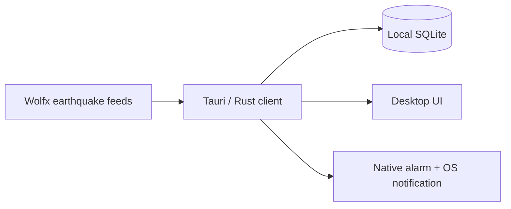

# QuakeSignal Desktop

Native earthquake monitoring for macOS and Windows, built with Tauri 2, Rust,
TypeScript, and local SQLite.

> [!IMPORTANT]
> QuakeSignal is an independent, non-official app. Upstream information can be
> delayed, incomplete, revised, or inaccurate. Always follow official emergency
> instructions.

## Local-first by design

The desktop app does **not** use the QuakeSignal server, Cloudflare Worker, user
accounts, or device registration. It connects directly to the seven Wolfx
WebSocket feeds and keeps its event history and preferences on the computer.
If a Wolfx WebSocket route remains unavailable for 90 seconds, it conservatively
refreshes only the affected public HTTPS snapshot at most every five minutes.
Those recovery snapshots are backfill: they update local history and never
create an alarm or notification.



This makes the desktop edition independent of the mobile push backend. An
internet connection is still required to receive live upstream data.

## Features

- Direct live monitoring of seven JMA, CENC, Sichuan, Fujian, and Chongqing
  feeds over three persistent upstream connections
- Native warning alarm that plays even when the main window is hidden
- Selectable standard tone, urgent tone, or original Japanese safety voice,
  plus a separate routine-report chime
- Alarm enable/disable, volume control, and a Test Alarm button
- Local magnitude, distance, and source filters
- Local SQLite history with no account or cloud synchronization
- Tray operation, launch-at-login preference, and native notifications
- English, Japanese, and Simplified Chinese

Cancelled and training messages never trigger an automatic alarm. The Test
Alarm button intentionally previews the sound locally.

The Japanese option is original synthesized safety guidance, not a J-Alert or
JMA recording. Its HTS Voice Mei attribution and exact asset hash are recorded
in `src-tauri/assets/ATTRIBUTION.md`. QuakeSignal does not invent or display a
seconds-until-shaking estimate.

## Develop

Prerequisites: Node.js 22+, Rust stable, and the
[Tauri system dependencies](https://v2.tauri.app/start/prerequisites/) for your
platform.

```bash
cd desktop
npm ci
npm run tauri dev
```

## Test and build

```bash
cd desktop
npm run build
cargo test --locked --manifest-path src-tauri/Cargo.toml
npm run tauri build
```

Native packages are written below `desktop/src-tauri/target/*/release/bundle`.
The current desktop release metadata is `1.1.0`; the next supported direct
macOS/Homebrew release must be built from a protected `v1.1.0` tag. Keep
`package.json`, `Cargo.toml`, and `tauri.conf.json` aligned before creating a
later release tag.

The pull-request workflow may use an ad-hoc macOS signature for a test build.
That artifact is never a public release. The protected release workflow can
produce two macOS lanes when its environments are configured: a Developer ID
signed, notarized, stapled universal DMG for direct download/Homebrew, and a
separate sandboxed Mac App Store `.pkg`. Because this repository is public, the
App Store package is never retained as a workflow artifact or attached to the
public GitHub Release. Its dormant hash/log-only mode records verification logs and
a SHA-256 digest, then deletes the package; signed-build visual approval remains
blocked until a release owner approves a separate private handoff mechanism.

No supported macOS binary or Homebrew cask is public yet. The `v0.1.0` GitHub
Release predates Developer ID signing and notarization, and the
`TastyHeadphones/tap` cask has not been published and must not be treated as
installable. Publish a later notarized, stapled DMG with `SHA256SUMS.txt` first,
then mirror its matching cask to a public tap.
