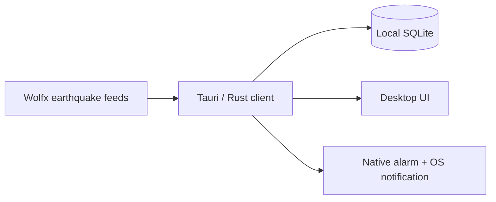

# QuakeSignal Desktop

Native earthquake monitoring for macOS and Windows, built with Tauri 2, Rust,
TypeScript, and local SQLite.

> [!IMPORTANT]
> QuakeSignal is an independent, non-official app. Upstream information can be
> delayed, incomplete, revised, or inaccurate. Always follow official emergency
> instructions.

## Local-first by design

The desktop app does **not** use the QuakeSignal server, Cloudflare Worker, user
accounts, or device registration. It connects directly to the seven Wolfx
WebSocket feeds and keeps its event history and preferences on the computer.



This makes the desktop edition independent of the mobile push backend. An
internet connection is still required to receive live upstream data.

## Features

- Direct live monitoring of seven JMA, CENC, Sichuan, Fujian, and Chongqing
  feeds over three persistent upstream connections
- Native warning alarm that plays even when the main window is hidden
- Separate EEW warning pattern and new-report chime
- Alarm enable/disable, volume control, and a Test Alarm button
- Local magnitude, distance, and source filters
- Local SQLite history with no account or cloud synchronization
- Tray operation, launch-at-login preference, and native notifications
- English, Japanese, and Simplified Chinese

Cancelled and training messages never trigger an automatic alarm. The Test
Alarm button intentionally previews the sound locally.

## Develop

Prerequisites: Node.js 22+, Rust stable, and the
[Tauri system dependencies](https://v2.tauri.app/start/prerequisites/) for your
platform.

```bash
cd desktop
npm ci
npm run tauri dev
```

## Test and build

```bash
cd desktop
npm run build
cargo test --locked --manifest-path src-tauri/Cargo.toml
npm run tauri build
```

Native packages are written below `desktop/src-tauri/target/*/release/bundle`.
The GitHub Actions workflow builds a universal macOS application/DMG and a
Windows x64 MSI/NSIS installer, then uploads them as workflow artifacts.
Pushing a version tag such as `v0.1.0` also creates a GitHub Release, generates
release notes, and attaches every native installer to that release.

CI applies an ad-hoc macOS signature so downloaded test builds remain
launchable. Public distribution should replace it with an Apple Developer ID
certificate and notarization, plus an appropriate code-signing certificate for
Windows.
