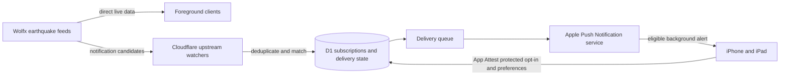

# QuakeSignal feature and architecture guide

This document describes the user-facing capabilities, platform differences,
and backend responsibilities across the QuakeSignal product. Platform support
is intentionally not identical: full-screen devices provide the complete
experience, while Watch and TV focus on foreground monitoring and the
Cloudflare service exists only to support secure background notifications.

QuakeSignal is an independent earthquake-information client. It does not
predict earthquakes and is not an official warning service. Users should
always follow instructions from local authorities and official emergency
services.

## Product map

| Component | Primary experience | Live data path | Background alerts |
| --- | --- | --- | --- |
| iPhone and iPad | Complete native SwiftUI app | Direct Wolfx feeds in the foreground | Opt-in APNs through the Cloudflare relay |
| Mac Catalyst | Complete native SwiftUI app adapted for Mac | Direct Wolfx feeds | No relay registration; foreground/local behavior only |
| Apple Vision Pro | Complete native SwiftUI app with spatial-window adaptations | Direct Wolfx feeds | No relay registration; foreground/local behavior only |
| Apple Watch | Focused dashboard, recent reports, details, and emergency presentation | Direct Wolfx feeds with bounded HTTP fallback | Foreground sound and haptics only |
| Apple TV | Focused dashboard, recent reports, and emergency presentation | Direct Wolfx feeds with bounded HTTP fallback | Foreground sound only |
| Desktop (Tauri) | Local-first desktop monitor for macOS and Windows | Direct Wolfx feeds with bounded HTTP backfill | Local native notifications and alarms while the app runs |
| Chrome extension | Compact browser monitor | Direct Wolfx feeds | Browser notifications and optional local alarm while Chrome runs |
| Cloudflare backend | Secure iPhone/iPad notification registration and delivery | Server-side upstream watchers | Sends eligible APNs notifications |
| Legacy Node harness | Local development and feed inspection | Direct Wolfx feeds | Development-only behavior; never production APNs |

## Shared earthquake experience

### Live sources and event lifecycle

QuakeSignal consumes seven Wolfx feeds across JMA, CENC, Sichuan, Fujian,
and Chongqing reporting channels. Platform clients normalize upstream payloads
into a common event model, deduplicate revisions, and preserve the lifecycle of
an event:

- preliminary
- updated
- final
- cancelled
- training or test

Source labels and status are kept visible so users can distinguish an early
estimate from a later revision or cancellation. The product does not convert
an upstream report into a claim of official certainty.

### Browsing and understanding events

The complete Apple interface provides:

- a live home dashboard and current alert state
- a chronological report list
- a map view with magnitude filtering
- event details with time, magnitude, depth, coordinates, source, and region
- a revision timeline showing how an event changed
- clear training, cancellation, stale-data, and connectivity states

Watch, TV, desktop, and Chrome use layouts appropriate to their surfaces while
retaining the core headline, source, magnitude, region, and event-status
information.

### Personal relevance and alert filters

Where supported, users can select their current location or a city and choose:

- minimum magnitude
- maximum distance or alert radius
- enabled reporting sources
- sound or alarm behavior

Distance is calculated from the selected location and an event's coordinates.
For opted-in iPhone/iPad background notifications, the relay receives only a
coarsened location (approximately 0.1-degree precision), the selected city
label, and the preferences needed to evaluate delivery.

### Preparedness and accessibility

The full Apple app includes an offline preparedness guide, a checklist, and
family check-in notes so important information remains available during a
network interruption. The interface supports English, Japanese, and
Simplified Chinese, Dynamic Type, VoiceOver-friendly labels, system appearance,
high-contrast presentation, and appropriately sized interaction targets.

## Apple platform features

### iPhone and iPad

iPhone and iPad provide the complete QuakeSignal experience: onboarding,
home, reports, map, event and revision details, preparedness tools, and
settings. Foreground monitoring connects directly to Wolfx rather than routing
normal browsing through QuakeSignal servers.

Background alerts are optional. When enabled, the app uses App Attest to prove
registration and mutation requests before storing an APNs device subscription
in the Cloudflare service. Users can change alert filters, test delivery, open
system notification settings, and unregister the device.

### Mac Catalyst

The Mac Catalyst app provides the full tabbed interface and direct foreground
feeds with desktop-friendly window behavior. It does not register with the
iPhone/iPad App Attest and APNs relay. Alerting is limited to behavior available
while the app is active.

### Apple Vision Pro

The visionOS app uses the full SwiftUI information architecture with
readability and spatial-window adaptations. It connects directly to live feeds
in the foreground and intentionally does not register for the iPhone/iPad
background notification relay.

### Apple Watch

The Watch app is optimized for quick foreground access:

- status dashboard and current headline
- recent reports and event detail
- manual refresh
- full-screen emergency presentation while active
- locally stored alert-mode preference, warning sound, and haptics
- WebSocket monitoring with conservative HTTP fallback when needed

It does not depend on a QuakeSignal account or register an independent APNs
subscription with the relay.

### Apple TV

The TV app provides a large-screen foreground dashboard, recent reports,
event/emergency presentation, and sound settings. It uses direct WebSocket data
with a bounded HTTP fallback. Apple TV does not register for relay-driven
background alerts; warning presentation and sound apply while the app is
running in the foreground.

## Desktop app

The Tauri desktop client is a local-first monitor for macOS and Windows. It
provides:

- direct connections to all seven Wolfx feeds over three upstream WebSockets
- native warning alarms, including a distinct EEW pattern and report chime
- alarm enablement, volume, and test controls
- magnitude, distance, and source filters
- local SQLite event history with no QuakeSignal account or cloud sync
- system-tray behavior, launch-at-login support, and native notifications
- English, Japanese, and Simplified Chinese

If the live connection remains unavailable, the client can perform a
conservative HTTPS snapshot backfill no more than once every five minutes after
a 90-second outage. Backfilled events repair local history and do not trigger
alarms.

## Chrome extension

The Manifest V3 Chrome extension is a compact, local browser client. It
connects directly to Wolfx, stores its event history in browser storage, shows
matching browser notifications, and can play an optional local alarm. Its
permissions are limited to the browser capabilities required for alarms,
notifications, offscreen audio, storage, and access to the Wolfx endpoint.

## Production Cloudflare backend

The Cloudflare Worker is the sole production backend. It is deliberately a
notification service, not an application-data proxy.

### Responsibilities

- issue App Attest challenges and validate attested iPhone/iPad requests
- register, update, test, and delete APNs notification subscriptions
- watch the required upstream feeds through Durable Objects
- normalize and deduplicate candidate events for notification delivery
- evaluate source, magnitude, distance, and locale preferences
- queue bounded APNs work with retries, dead-letter handling, and fallback paths
- retain subscription, deduplication, and delivery state in D1
- expose legal documents, health/readiness signals, and operational endpoints
- enforce native rate limits, anti-replay checks, and key-bound authorization

Production App Attest enforcement is mandatory. APNs credentials and other
service secrets are supplied through protected deployment environments and are
not stored in the repository.

### Intentional non-features

Public event history, event detail, and general live-relay routes are disabled
and return a retired response. Foreground clients obtain earthquake data
directly from Wolfx. This separation minimizes stored user data, reduces a
single point of failure, and prevents the production Worker from becoming an
unnecessary proxy for normal app use.

### Delivery flow

## Legacy Node backend harness

The root `backend/` Node service is a development harness retained for local
feed work. It opens Wolfx sockets, normalizes and deduplicates events, and
provides a development HTTP interface useful for debugging clients and payloads.
It is not deployed as the QuakeSignal production backend and must not be given
production APNs keys or configured to use production delivery endpoints.

## Privacy and safety boundaries

- No QuakeSignal account is required.
- Foreground earthquake browsing goes directly to the upstream provider.
- Desktop and Chrome history remains in local application or browser storage.
- Watch and TV store only the local settings needed for their foreground
  experience.
- The notification backend stores only the device token, locale, selected
  filters, coarse location/city information, and security/delivery state needed
  to provide an opted-in iPhone/iPad alert.
- App Attest proofs, anti-replay protections, request signing, and rate limits
  protect subscription mutations.
- QuakeSignal reports upstream data and is not a substitute for official
  warnings, emergency instructions, or professional safety advice.

## Capability matrix

| Capability | iPhone/iPad | Mac Catalyst | visionOS | watchOS | tvOS | Desktop | Chrome |
| --- | --- | --- | --- | --- | --- | --- | --- |
| Direct foreground feeds | Yes | Yes | Yes | Yes | Yes | Yes | Yes |
| Full reports/map/detail interface | Yes | Yes | Yes | Focused | Focused | Desktop-focused | Compact |
| Revision/status presentation | Yes | Yes | Yes | Focused | Focused | Yes | Yes |
| Preparedness guide and notes | Yes | Yes | Yes | No | No | No | No |
| Location, magnitude, and source filters | Yes | Yes | Yes | Limited | Limited | Yes | Yes |
| App Attest protected relay registration | Yes | No | No | No | No | No | No |
| APNs background earthquake alerts | Yes | No | No | No | No | No | No |
| Foreground/local sound or alarm | Yes | Yes | Yes | Yes | Yes | Yes | Optional |
| Local event history | Yes | Yes | Yes | Recent view | Recent view | SQLite | Browser storage |
| English, Japanese, Simplified Chinese | Yes | Yes | Yes | Yes | Yes | Yes | Yes |

## Related documentation

- [Wolfx feed reference](WOLFX_API.md)
- [Cloudflare production architecture and operations](CLOUDFLARE_PRODUCTION.md)
- [Privacy design](PRIVACY.md)
- [Product and visual design direction](DESIGN_PROMPT.md)
- [Apple signing and release setup](SIGNING.md)
- [Apple app source](../ios/)
- [Desktop source and setup](../desktop/)
- [Chrome extension source and setup](../extension/)
- [Production Cloudflare service](../backend/cloudflare/)
- [Legacy Node development harness](../backend/)
